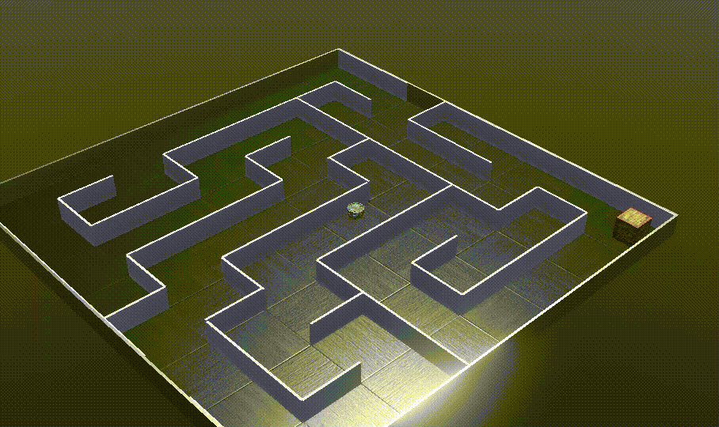

Maze Traveller. 
 
In this exercise we are again looking at an e-puck  working its way around a maze. 
 
Wall following is again useful 
(Just as it was in the prevous <a href="../MazeSolver/README.md">Maze Solver</a> exercise).  
 
Exercise: 
The robot must first find the box.  And
 then it must use its map of the world to find its way home.  As directly as possible. 
For more: See <a href="MazeTraveller.pdf">Maze traveller</a> exercise 
 
  

